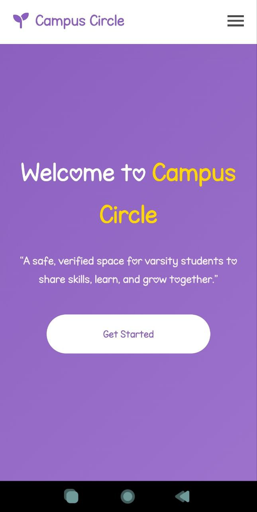

Project Overview :: 

CampusSkill Hub is an exclusive, AI-powered skill-sharing platform designed specifically for Varendra University students. We bridge the gap between academic learning and practical skill development by creating a safe, verified, and anonymous ecosystem where students can teach, learn, and grow together.
[ Demo Website Link ] : https://nahid-mahmud555.github.io/Campus-Circle/

    💡 Vision: To create Bangladesh's first university-specific skill-sharing economy powered by artificial intelligence.

✨ Key Features
🔒 Secure & Verified

    . Student ID Verification - Exclusive to Varendra University students

    . Anonymous Profiles - Privacy protection with standardized identities

    . I Content Moderation - Automated harassment detection and prevention

🤖 AI-Powered Intelligence

    . Smart Recommendations - Personalized skill suggestions based on department and interests

    . AI Chat Assistant - 24/7 campus guide and learning companion

    . Price Optimization - AI-driven pricing suggestions for skills and services

📱 Complete Platform Experience

    . Multi-format Listings - Skills, products, courses, and help requests

    . Real-time Newsfeed - Dynamic campus activity stream

    . Secure Transactions - In-platform payments with minimal commission

    . Department Filtering - Targeted visibility and discovery

### Desktop View – Campus Circle

### Mobile View – Campus Circle

